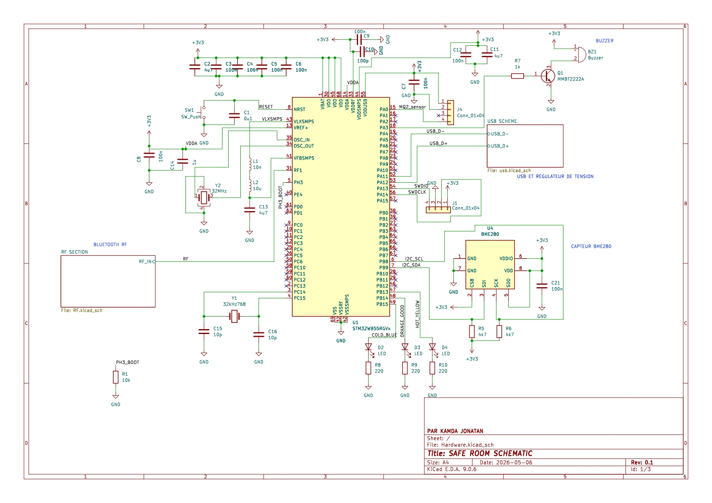
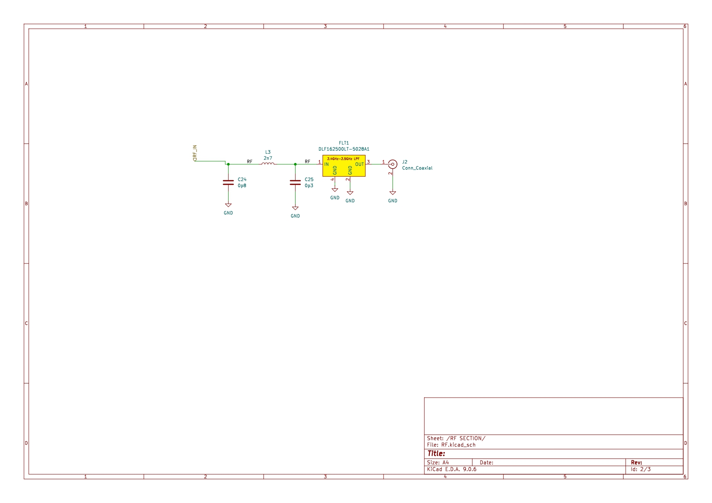
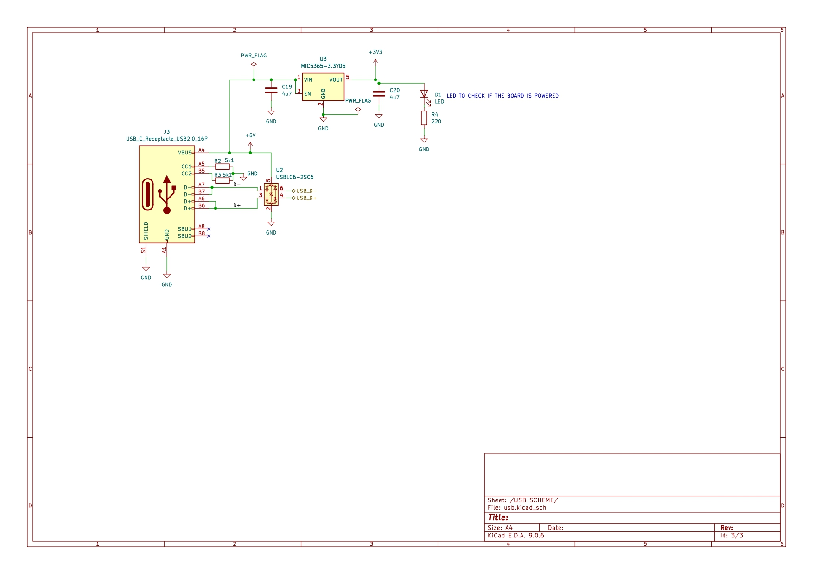
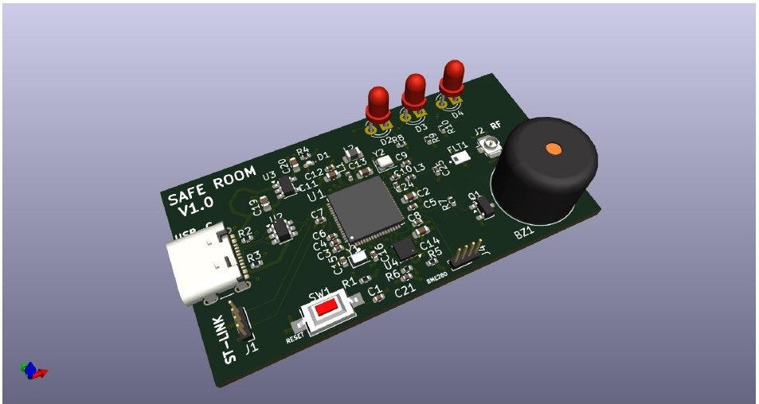

# SAFE-ROOM
SAFE ROOM est une dispositif électronique qui permet de connaitre en temps réel, les conditions d'une pièce. A savoir la qualité d'air, la temperature, l'humidité, et la pression.  Ce projet intègre également une antenne bluetooth qui permet de transmettre sur une platform les données capteur.

# SCHEMATIQUE DU PROJET
La schématique a été réalisé avec KiCAD 9.0

# CARTE SAFE ROOM
